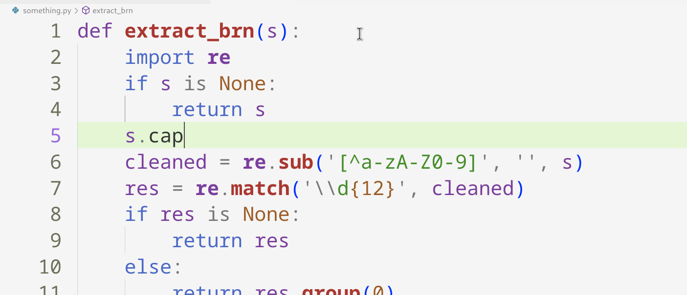

# 类型应用入门零
# 前言
近来上司开始鼓励同事们用pydantic让ETL源码更加可靠。
不过，一般大学计课程不会教同学们类型论基础。
因此，我同事们不熟悉。
相关入门也比较匮乏，故此我写以下笔记。

# 前置
面向python的开发者，但只要求读者至少会一门编程语言。

# 使用类型系统的收益
以Python为例

类型标注可以现代IDE代码补全更加智能/type hints得以可能：比如依据对象类型自动列举相关办法，文档。

没有标注`s`形参类型

标注`s`形参类型后

因`s`是string类型而string有`capitalize`的函数
所以vscode显示`capitalize`的文档

类型标注比注释是更好的文档，也是一种实现和调用双方的契约


图上为`extract_brn`的函数定义，其他开发者可以依据型参类型来合规地调用。

```py
extract_brn(123)
extract_brn(None)
extract_brn(true)
```

如果如上调用，调用方可以默认以上程序是可以出错，
因为`extract_brn`函数假设形参`s`为string,
如果程序使用其他类型的数据传参，就已经破坏这个前提，
该函数的开发者可以因此不保证其正确运行。

# 如何推导类型？
注：作者使用”类型推理“特指type inference, 类型推导特指”type derivation“

```py
1 : int
```
朗读出来
> 1是integer类型

以下是加法类型规则
```py
e1 : int
e2 : int
---
e1 + e2 : int
```
朗读出来
> 如果两个相加的类型都是integer类型，那么结果的类型也是integer。

如果找不到对应的规则，就是类型错误。

例子一,
```py
2 : int
3 : int
---
2 + 3 : int
```

例子二,
```py
2 + 3   : int
5       : int
---
2 + 3 + 5 : int
```

例子三,
```py
'2' : str
3   : int
---
'2' + 3 : error
```

# 知道类型是如何可以帮助你诊断问题
假设以下规则和前提是正确

```py
print : ((str, float) -> None)
input : ((str) -> str)

# multiplication
f1 : float
f2 : float
---
f1 * f2 : float

# function call 1
a1 : t1
fn : ((t1) -> t2)
---
fn(a1) : t2

# function call 2
a1 : t1
a2 : t2
fn : ((t1,t2) -> t3)
---
fn(a1,a2) : t3
```
为什么以下`python`程序会报错?
```py
print("Service Tax is:", input('enter a value:')  * 0.06)
```

如果推导这程序的类型,

```py
print("Service Tax is:", input('enter a value:')  * 0.06)
| # use function call 2
| "Service Tax is:" : str
| input('enter a value:')  * 0.06
| | # use multiplication
| | input('enter a value:')
| | | # function call 1
| | | input : ((str) -> str)
| | | 'enter a value:' : str
| | input('enter a value:') : str
| | 0.6 : float
| error # because float cannot multiply with str
```

转换`input`的返回值为浮点，程序就能跑。

# 前传：为什么编程语言会有数据类型
很多人都是在C语言入门课，第一次接触到类型

```c
#include<stdio.h>

int max(int x, int y){
    if(x < y){
        return y;
    }else{
        return x;
    }
}

int main(){
    int x = 17;
    int y = 13;
    printf("max(%d, %d) => %d\n", x, y, max(x, y));
    return 0;
}
```

类型一旦声明错误，什么类型错误的报错会让人摸不着头脑。
当时C语言设计时代背景，类型声明可以让编译器可以确定数据在内存如何读写。
C语言前身，B语言，初衷用来写操作系统，无类型，一切数据为字，字长为寄存器的大小。
当时PDP-11电脑可以以字节颗度地址来读取内存，而且一个字节刚好可以表示一个ASCII字符。一个16比特字长可以塞两个字符，可以更好利用内存资源。
由于文本处理需求，Dennis拓展B语言支持字节数据类型。他<del>戏称</del>称之为new B (吐槽：大佬就是不一样，非常牛逼)。
有些计算机的指令集架构下，浮点运算和整数运算使用各自一套不一样机器指令和寄存器，所以编译器也需要编译相应的指令。

通过以上个案，数据类型的引入是自然而然的。

# 拓展阅读
- Essentials of Programming Languages by Daniel P. Friedman and Mitchell Wand
- Types and Programming Languages by Benjamin C. Pierce
- The Little Typer by Daniel P. Friedman and David Thrane Christiansen
- [https://www.manjusaka.blog/posts/2020/03/20/a-simple-history-about-type-hint-in-python/index.html](https://www.manjusaka.blog/posts/2020/03/20/a-simple-history-about-type-hint-in-python/index.html)